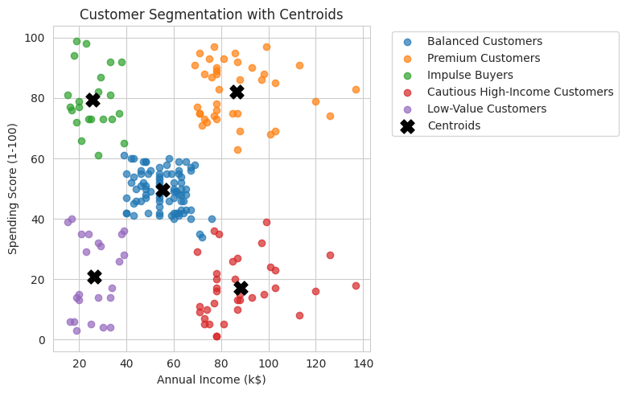

# Mall Customer Segmentation

## Project Overview

This project focuses on customer segmentation using clustering techniques applied to mall customer data.

The objective is to identify groups of customers with similar spending behavior in order to support business intelligence and targeted marketing strategies.

Different clustering algorithms are compared, with a particular focus on cluster interpretability and business insights.

---

## Dataset

The dataset contains customer demographic and behavioral information, including:

- Age
- Annual Income
- Spending Score
- Gender
- Education
- Marital Status

Source: Kaggle Mall Customers Dataset.

---

## Objectives

- Perform exploratory data analysis (EDA)
- Preprocess and scale the data
- Identify the optimal number of clusters
- Compare different clustering algorithms
- Interpret customer segments from a business perspective

---

## Technologies Used

- Python
- Pandas
- NumPy
- Matplotlib
- Seaborn
- Scikit-learn

---

## Workflow

### 1. Exploratory Data Analysis (EDA)

The dataset is analyzed to understand:

- data quality
- variable distributions
- relationships between income and spending behavior

### 2. Preprocessing

The preprocessing phase includes:

- removal of irrelevant features
- feature selection
- feature scaling using `StandardScaler`

### 3. Choosing the Number of Clusters

The Elbow Method is used to identify the optimal number of clusters.

### 4. Clustering Models

The following clustering algorithms are compared:

- K-Means
- Agglomerative Clustering
- DBSCAN

Models are evaluated using the silhouette score.

### 5. Business Interpretation

Customer segments are analyzed and translated into meaningful business profiles such as:

- Premium Customers
- Impulse Buyers
- Balanced Customers
- Low-Value Customers

---

## Results

K-Means achieved the best balance between:

- cluster separation
- simplicity
- interpretability

The analysis successfully identified distinct customer segments with different income and spending behaviors.

---

## Final Visualization

---

## Conclusion

This project demonstrates how clustering techniques can support customer segmentation and business decision-making.

The workflow combines exploratory analysis, preprocessing, model comparison, and business interpretation to produce actionable insights from customer data.
